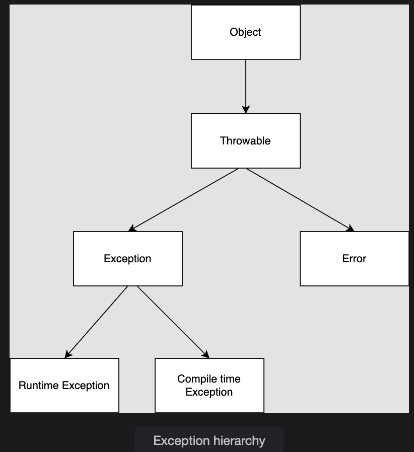

# Java Exception Handling — Types of Exceptions
> *Understand checked and unchecked exceptions and when each occurs.*

---

## Introduction

In Java, every exception is a subclass of the `Exception` class, which itself is a subclass of `Throwable`. All exceptions are divided into two major categories based on **when** the compiler checks for them:

- **Checked Exceptions** — detected at *compile time*
- **Unchecked Exceptions** — detected at *runtime*

Understanding which category an exception falls into tells you whether you **must** handle it or whether it's optional.

---

## The Exception Hierarchy

```
java.lang.Throwable
├── java.lang.Error               ← Serious JVM problems (don't catch these)
│   ├── OutOfMemoryError
│   ├── StackOverflowError
│   └── ...
└── java.lang.Exception
    ├── RuntimeException          ← UNCHECKED (runtime exceptions)
    │   ├── ArithmeticException
    │   ├── NullPointerException
    │   ├── ArrayIndexOutOfBoundsException
    │   ├── NumberFormatException
    │   ├── ClassCastException
    │   └── ...
    └── Checked Exceptions        ← CHECKED (compile-time exceptions)
        ├── IOException
        │   └── FileNotFoundException
        ├── ClassNotFoundException
        ├── SQLException
        └── ...
```


---

## Checked vs. Unchecked — At a Glance

| Feature | Checked Exceptions | Unchecked Exceptions |
|---|---|---|
| **Also called** | Compile-time exceptions | Runtime exceptions |
| **Detected by compiler?** | ✅ Yes — at compile time | ❌ No — only at runtime |
| **Must handle or declare?** | ✅ Yes — compile error if not | ❌ No — optional |
| **Extends** | `Exception` (but NOT `RuntimeException`) | `RuntimeException` |
| **Known before running?** | Yes — the scenario is predictable | No — depends on actual data |
| **Examples** | `IOException`, `ClassNotFoundException` | `ArithmeticException`, `NullPointerException` |

---

## Checked Exceptions

Checked exceptions are **verified by the compiler at compile time**. If your code might throw a checked exception, you must either:
1. Handle it with `try`-`catch`, **OR**
2. Declare it with `throws` in the method signature

If you do neither, the compiler refuses to compile the code.

---

### `IOException`

Thrown when there is a problem **reading or writing files or streams**.

```java
import java.io.*;

try {
    FileInputStream in = new FileInputStream("file.txt");
    // read from file...
} catch (IOException e) {
    System.out.print(e);
}
```

If the file `file.txt` doesn't exist, Java throws a `FileNotFoundException` — which is a **subclass** of `IOException`.

```
IOException
└── FileNotFoundException   ← thrown when the file path doesn't exist
└── EOFException            ← thrown when end of file is reached unexpectedly
└── SocketException         ← thrown on network connection issues
```

> 💡 Since `FileNotFoundException` IS-A `IOException`, catching `IOException` will also catch `FileNotFoundException`.

```java
// This catches both IOException AND FileNotFoundException:
} catch (IOException e) {
    System.out.print("File error: " + e.getMessage());
}
```

---

### `ClassNotFoundException`

Thrown when the **JVM tries to load a class by name** but cannot find it in the classpath.

```java
try {
    Class.forName("MyClass");   // tries to find and load "MyClass"
} catch (ClassNotFoundException e) {
    e.printStackTrace();
}
```

This is common when:
- Using JDBC to load a database driver: `Class.forName("com.mysql.jdbc.Driver")`
- Loading a plugin or module dynamically at runtime

```java
// Realistic JDBC example:
try {
    Class.forName("com.mysql.jdbc.Driver");
    System.out.println("Driver loaded successfully");
} catch (ClassNotFoundException e) {
    System.out.println("Driver not found: " + e.getMessage());
}
```

---

### Other Common Checked Exceptions

| Exception | Thrown When |
|---|---|
| `IOException` | File read/write problems |
| `FileNotFoundException` | File path doesn't exist |
| `ClassNotFoundException` | Class not found in classpath |
| `SQLException` | Database access error |
| `ParseException` | String cannot be parsed to a date/number |
| `InterruptedException` | Thread interrupted while sleeping or waiting |

---

## Unchecked Exceptions

Unchecked exceptions are **not verified at compile time** — they are only discovered when the program actually runs. The compiler has no way of knowing they will occur because they depend on the **actual data values at runtime**.

```java
class Exceptions {
    public static void main(String args[]) {
        int gainedMarks = 5;
        int totalMarks = 0;
        System.out.println(gainedMarks / totalMarks);  // throws ArithmeticException
    }
}
```

### Output

```
Exception in thread "main" java.lang.ArithmeticException: / by zero
    at Exceptions.main(main.java:6)
```

The compiler sees `gainedMarks / totalMarks` and doesn't flag it — it can't know that `totalMarks` will be `0` until the code actually runs. If `totalMarks` were `5`, no exception would occur:

```java
int salary = 5;
int bonus = 0;
System.out.println(salary + bonus);  // prints 5, no exception
```

---

### `ArrayIndexOutOfBoundsException`

Thrown when an array is accessed with an index that is **out of its valid range**.

Valid indices for an array of size `n` are: `0` to `n-1`.

```java
int[] arr = {11, 12, 13};  // valid indices: 0, 1, 2

System.out.print(arr[-1]);  // ❌ less than 0 → ArrayIndexOutOfBoundsException
System.out.print(arr[3]);   // ❌ equal to size → ArrayIndexOutOfBoundsException
System.out.print(arr[4]);   // ❌ greater than size → ArrayIndexOutOfBoundsException
System.out.print(arr[2]);   // ✅ valid → prints 13
```

```java
// How to avoid it:
for (int i = 0; i < arr.length; i++) {  // arr.length = 3, so i goes 0,1,2
    System.out.println(arr[i]);
}
```

---

### `NumberFormatException`

Thrown when a `String` that **cannot be converted** to a number is passed to methods like `Integer.parseInt()`.

```java
int a = Integer.parseInt("$6k");  // ❌ invalid — contains $, letters
int b = Integer.parseInt("6");    // ✅ valid
int c = Integer.parseInt("-6");   // ✅ valid — negative number
int d = Integer.parseInt("+6");   // ✅ valid — explicit positive
int e = Integer.parseInt(" 6");   // ❌ invalid — leading space
int f = Integer.parseInt("6.0");  // ❌ invalid — decimal point (use Double.parseDouble)
```

```java
// Safe parsing pattern:
try {
    int value = Integer.parseInt(userInput);
    System.out.println("Parsed: " + value);
} catch (NumberFormatException e) {
    System.out.println("Invalid number format: " + userInput);
}
```

---

### `ArithmeticException`

Thrown when an **illegal arithmetic operation** is performed — most commonly dividing by zero.

```java
int a = 5;
int b = 0;
System.out.print(a / b);  // ❌ 5/0 → ArithmeticException: / by zero
```

> 💡 Note: This only applies to **integer division**. Dividing a `double` by zero does **not** throw an exception — it returns `Infinity` or `NaN`.

```java
int    intResult   = 5 / 0;       // ❌ ArithmeticException
double doubleResult = 5.0 / 0;    // ✅ No exception → Infinity
double nanResult    = 0.0 / 0.0;  // ✅ No exception → NaN
```

---

### `NullPointerException`

Thrown when you try to **access a member (method, field, length)** of a `null` reference — i.e., a variable that points to nothing.

```java
String str = null;
System.out.print(str.length());   // ❌ str is null → NullPointerException
```

```java
// More NPE examples:
String[] arr = null;
System.out.print(arr.length);     // ❌ NullPointerException

Object obj = null;
obj.toString();                   // ❌ NullPointerException

// ✅ Safe check before use:
if (str != null) {
    System.out.print(str.length());
}

// ✅ Or use Objects.isNull / Optional:
String safe = (str != null) ? str : "default";
```

---

### Other Common Unchecked Exceptions

| Exception | Thrown When |
|---|---|
| `ArithmeticException` | Integer division by zero |
| `NullPointerException` | Accessing member of a null reference |
| `ArrayIndexOutOfBoundsException` | Array index < 0 or >= array length |
| `NumberFormatException` | Invalid string-to-number conversion |
| `ClassCastException` | Invalid object type cast |
| `StackOverflowError` | Infinite recursion exhausts call stack |
| `StringIndexOutOfBoundsException` | String index out of bounds |
| `IllegalArgumentException` | Invalid argument passed to a method |

---

## Why the Distinction Matters

```
Checked Exceptions → represent EXTERNAL factors
  (file doesn't exist, network down, database unreachable)
  → You CAN anticipate and plan for these
  → Compiler forces you to handle them

Unchecked Exceptions → represent PROGRAMMING BUGS
  (wrong index, null reference, bad input)
  → These should be PREVENTED by writing correct code
  → Compiler does NOT force handling — fix the logic instead
```

---

## Identifying Which Category

A quick way to identify the category:

```java
// Is it a RuntimeException (or subclass of it)?
ArithmeticException       → extends RuntimeException → UNCHECKED ✓
NullPointerException      → extends RuntimeException → UNCHECKED ✓
NumberFormatException     → extends RuntimeException → UNCHECKED ✓

// Is it a direct subclass of Exception (but NOT RuntimeException)?
IOException               → extends Exception → CHECKED ✓
ClassNotFoundException    → extends Exception → CHECKED ✓
SQLException              → extends Exception → CHECKED ✓
```

---

## Key Highlights

| Rule | Detail |
|---|---|
| All exceptions extend `Exception` | Which extends `Throwable` |
| Checked = compile-time | Must handle or declare with `throws` |
| Unchecked = runtime | Optional to handle; usually indicate bugs |
| `RuntimeException` subclasses = unchecked | Everything else under `Exception` = checked |
| `Error` subclasses | Serious JVM issues — should not be caught normally |

---

## Test Yourself

**Question 1:** Which of these is a checked exception?
- a) `NullPointerException`
- b) `IOException`
- c) `ArithmeticException`
- d) `ArrayIndexOutOfBoundsException`
<details>
<summary>Answer</summary>
<strong>b) IOException</strong> — It extends <code>Exception</code> directly and is not a subclass of <code>RuntimeException</code>. The others are all unchecked.
</details>

**Question 2:** Will this compile?
```java
import java.io.*;
public class Test {
    public static void main(String[] args) {
        FileInputStream f = new FileInputStream("test.txt");
    }
}
```
<details>
<summary>Answer</summary>
<strong>No — Compile Error.</strong> <code>FileInputStream</code> constructor throws a checked <code>FileNotFoundException</code>. You must either wrap it in a <code>try-catch</code> or declare <code>throws FileNotFoundException</code> on <code>main</code>.
</details>

**Question 3:** What is the output?
```java
public class Test {
    public static void main(String[] args) {
        String s = "hello";
        System.out.println(Integer.parseInt(s));
    }
}
```
<details>
<summary>Answer</summary>
<strong>Exception in thread "main" java.lang.NumberFormatException: For input string: "hello"</strong> — <code>"hello"</code> cannot be parsed as an integer.
</details>

---

