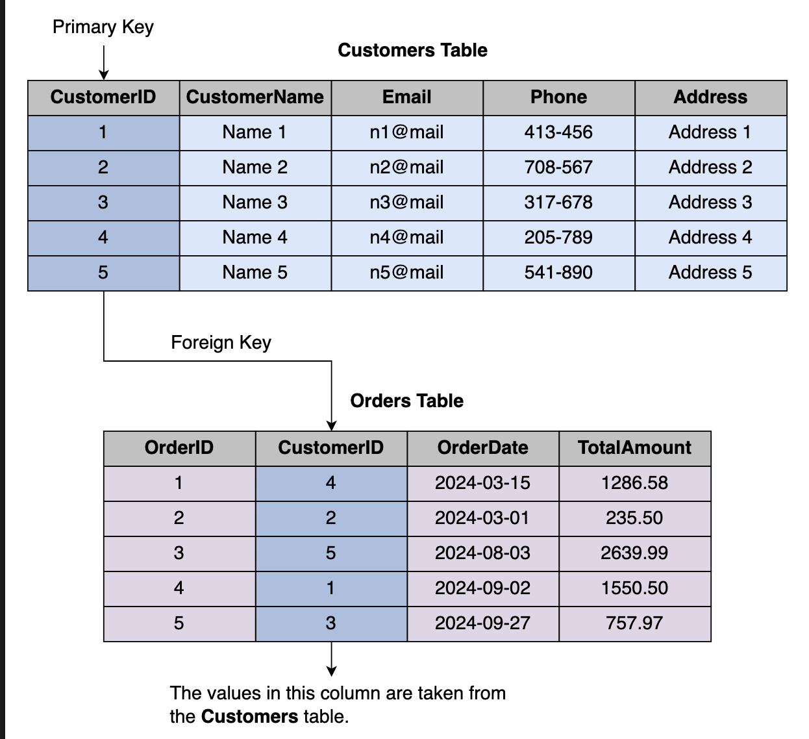

# Constraints on Tables
> *Learn about constraints that can be applied on tables using SQL.*

---

## Introduction

When managing an online store's database, it's our responsibility to provide customers with accurate and consistent information about products, orders, and more. For example, we can't store a product without a valid name, or an order without a valid customer. To prevent such inconsistencies, we need rules that safeguard the integrity of our data. In SQL, these rules are called **constraints**.

### 🎯 Learning Goals

- ✅ Use `NOT NULL` to ensure the presence of data in mandatory fields
- ✅ Use `UNIQUE` to prevent duplicate values in a column
- ✅ Define primary keys using `PRIMARY KEY`
- ✅ Establish relationships between tables using `FOREIGN KEY`
- ✅ Implement `AUTO_INCREMENT` to automatically generate unique identifiers

---

## What Are Constraints?

Constraints are **rules applied to columns** in a table that control what data can be inserted, updated, or deleted. They protect data quality at the database level — meaning the database itself rejects invalid data before it ever gets stored.

Constraints can be defined:
- **At table creation** — using `CREATE TABLE`
- **After table creation** — using `ALTER TABLE`

### Constraints Covered in This Guide

| Constraint | Purpose |
|---|---|
| `NOT NULL` | Ensures a column always has a value |
| `UNIQUE` | Prevents duplicate values in a column |
| `PRIMARY KEY` | Uniquely identifies each row in a table |
| `FOREIGN KEY` | Links two tables and enforces referential integrity |
| `AUTO_INCREMENT` | Automatically generates a unique number for new rows |

---

## 1️⃣ `NOT NULL` Constraint

### Understanding NULL Values

In SQL, a `NULL` value represents **missing or unknown data**. By default, every column allows `NULL` values unless explicitly told otherwise.

> 💡 `NULL` is not the same as zero (`0`) or an empty string (`''`) — it literally means "no value exists."

### Why Use `NOT NULL`?

Imagine a `Customers` table where `CustomerName` is `NULL` — how would we identify who placed an order? The `NOT NULL` constraint ensures a column **always contains a value** when a record is inserted or updated.

### Syntax

```sql
ColumnName DataType NOT NULL
```

### Example — Single Column

```sql
CREATE TABLE Customers (
    CustomerID   INT,
    CustomerName VARCHAR(50) NOT NULL,  -- Name is required
    Email        VARCHAR(50),
    Phone        VARCHAR(15),
    Address      VARCHAR(100)
);
```

### Example — Multiple Columns

```sql
CREATE TABLE Customers (
    CustomerID   INT,
    CustomerName VARCHAR(50) NOT NULL,  -- Name is required
    Email        VARCHAR(50) NOT NULL,  -- Email is also required
    Phone        VARCHAR(15),
    Address      VARCHAR(100)
);
```

> ✅ Apply `NOT NULL` to any column where a missing value would make the record meaningless or unusable.

---

## 2️⃣ `UNIQUE` Constraint

### Why Use `UNIQUE`?

Some columns must never have duplicate values across rows. For example, two different customers cannot share the same email address. The `UNIQUE` constraint enforces this rule.

When a `UNIQUE` constraint is set, the database:
1. Creates an **index** for the column
2. Checks the index on every insert or update
3. **Rejects the operation** if a duplicate value is found

### Syntax

```sql
ColumnName DataType UNIQUE
```

### Example

```sql
CREATE TABLE Customers (
    CustomerID   INT,
    CustomerName VARCHAR(50) NOT NULL,
    Email        VARCHAR(50) NOT NULL UNIQUE,  -- No two customers can share an email
    Phone        VARCHAR(15),
    Address      VARCHAR(100)
);
```

> 💡 A column can have **multiple constraints at once** — `NOT NULL UNIQUE` means the field must have a value *and* it must be different from all other values.

### `UNIQUE` vs `PRIMARY KEY`

| Feature | `UNIQUE` | `PRIMARY KEY` |
|---|---|---|
| Prevents duplicates | ✅ Yes | ✅ Yes |
| Allows NULL | ✅ Yes (one NULL allowed) | ❌ No |
| Can be referenced by FOREIGN KEY | ❌ No | ✅ Yes |
| Per table | Multiple allowed | Only one per table |

---

## 3️⃣ `PRIMARY KEY` Constraint

### Why Use `PRIMARY KEY`?

Every table needs a way to **uniquely identify each row**. Without it, there's no reliable way to find, update, or delete a specific record. The `PRIMARY KEY` constraint combines the power of both `NOT NULL` and `UNIQUE` — automatically enforcing both rules on the chosen column.

### Key Facts

- A table can have **only one** `PRIMARY KEY`
- The `PRIMARY KEY` column cannot contain `NULL` values
- The `PRIMARY KEY` column cannot contain duplicate values
- It can be **referenced by other tables** via `FOREIGN KEY`

### Syntax — Inline

```sql
ColumnName DataType PRIMARY KEY
```

### Syntax — Separate Definition

```sql
PRIMARY KEY (ColumnName)
```

### Example

```sql
CREATE TABLE Customers (
    CustomerID   INT PRIMARY KEY,       -- Unique, non-null identifier
    CustomerName VARCHAR(50) NOT NULL,
    Email        VARCHAR(50) NOT NULL UNIQUE,
    Phone        VARCHAR(15) NOT NULL,
    Address      VARCHAR(100) NOT NULL
);
```

> ✅ Always define a `PRIMARY KEY` on every table. It is the foundation for relationships, indexing, and reliable data retrieval.

---

## 4️⃣ `FOREIGN KEY` Constraint

### The Problem Without `FOREIGN KEY`

If the `Orders` table had its own unrelated `CustomerID` column (not linked to `Customers`), several issues could arise:

| Problem | Description |
|---|---|
| ❌ Manual consistency needed | You'd have to manually ensure IDs match across tables |
| ❌ Orphaned records | Orders could exist for customers that don't exist |
| ❌ Data drift | Updating a customer in one place won't reflect elsewhere |
| ❌ Broken deletes | Deleting a customer won't remove their related orders |
| ❌ Faulty analysis | Mismatched data leads to incorrect reports |

### How `FOREIGN KEY` Solves This

A `FOREIGN KEY` creates a **link between two tables**, enforcing **referential integrity**. It ensures that a value in one table always corresponds to a valid record in another.

- The table holding the **`PRIMARY KEY`** is the **parent table**
- The table holding the **`FOREIGN KEY`** is the **child table**

### Syntax

```sql
FOREIGN KEY (ColumnName) REFERENCES ParentTable(ParentColumn)
```

### Visual: How FOREIGN KEY Works

```
Customers Table (Parent)          Orders Table (Child)
┌────────────┬──────────────┐     ┌─────────┬────────────┐
│ CustomerID │ CustomerName │     │ OrderID │ CustomerID │ ← FOREIGN KEY
├────────────┼──────────────┤     ├─────────┼────────────┤
│     1      │   Name 1     │◄────│    1    │     4      │
│     2      │   Name 2     │     │    2    │     2      │
│     3      │   Name 3     │     │    3    │     5      │
│     4      │   Name 4     │     │    4    │     1      │
│     5      │   Name 5     │     │    5    │     3      │
└────────────┴──────────────┘     └─────────┴────────────┘
      ▲ PRIMARY KEY                     ▲ References CustomerID
                                          from Customers table
```

> The `CustomerID` column in the `Orders` table takes its values directly from the `Customers` table. The values in the `CustomerID` column of `Orders` must exist in the `Customers` table — this is **referential integrity**.

### Example

```sql
CREATE TABLE Orders (
    OrderID     INT PRIMARY KEY,
    CustomerID  INT,
    OrderDate   DATE NOT NULL,
    TotalAmount DECIMAL(10, 2) NOT NULL,
    FOREIGN KEY (CustomerID) REFERENCES Customers(CustomerID)
    -- CustomerID must exist in the Customers table
);
```

### Benefits of Using `FOREIGN KEY`

| Benefit | Description |
|---|---|
| ✅ Consistent data | Customer info stays aligned across tables |
| ✅ Prevents invalid entries | Can't insert an OrderID with a non-existent CustomerID |
| ✅ Automatic propagation | Changes in parent table reflect in child table |
| ✅ No data redundancy | No need to repeat customer details in every order row |
| ✅ Cleaner data management | Easier to query, maintain, and analyze |

---

## 5️⃣ `AUTO_INCREMENT`

### Why Use `AUTO_INCREMENT`?

Without `AUTO_INCREMENT`, you'd need to manually track and enter a unique ID for every new record inserted. This is error-prone and time-consuming. `AUTO_INCREMENT` handles this automatically.

### How It Works

- By default, starts at **1** and increases by **1** for each new row
- Best used with `PRIMARY KEY` columns
- MySQL allows customizing the starting value

### Syntax

```sql
ColumnName DataType PRIMARY KEY AUTO_INCREMENT
```

### Example — Default Start (1)

```sql
CREATE TABLE Customers (
    CustomerID   INT PRIMARY KEY AUTO_INCREMENT,  -- 1, 2, 3, ...
    CustomerName VARCHAR(50) NOT NULL,
    Email        VARCHAR(50) NOT NULL UNIQUE,
    Phone        VARCHAR(15),
    Address      VARCHAR(100)
);
```

### Example — Custom Starting Value

```sql
CREATE TABLE Customers (
    CustomerID   INT PRIMARY KEY AUTO_INCREMENT = 1001,  -- 1001, 1002, 1003, ...
    CustomerName VARCHAR(50) NOT NULL,
    Email        VARCHAR(50) NOT NULL UNIQUE,
    Phone        VARCHAR(15),
    Address      VARCHAR(100)
);
```

| New Record | Auto-Assigned CustomerID |
|---|---|
| First customer | 1001 |
| Second customer | 1002 |
| Third customer | 1003 |

> ✅ Use `AUTO_INCREMENT` on every `PRIMARY KEY` column — it eliminates manual ID management and prevents duplicate key errors.

---

## 🧪 Full Example — OnlineStore with All Constraints

Here's the complete `OnlineStore` database with all constraints applied across every table:

```sql
CREATE DATABASE OnlineStore;
USE OnlineStore;

-- Categories table (parent of Products)
CREATE TABLE Categories (
    CategoryID   INT PRIMARY KEY AUTO_INCREMENT,
    CategoryName VARCHAR(50) NOT NULL UNIQUE
);

-- Products table (child of Categories)
CREATE TABLE Products (
    ProductID   INT PRIMARY KEY AUTO_INCREMENT,
    ProductName VARCHAR(100) NOT NULL,
    CategoryID  INT NOT NULL,
    Price       DECIMAL(10, 2) NOT NULL,
    Stock       INT NOT NULL,
    FOREIGN KEY (CategoryID) REFERENCES Categories(CategoryID)
);

-- Customers table (parent of Orders)
CREATE TABLE Customers (
    CustomerID   INT PRIMARY KEY AUTO_INCREMENT,
    CustomerName VARCHAR(50) NOT NULL,
    Email        VARCHAR(50) NOT NULL UNIQUE,
    Phone        VARCHAR(15),
    Address      VARCHAR(100)
);

-- Orders table (child of Customers)
CREATE TABLE Orders (
    OrderID     INT PRIMARY KEY AUTO_INCREMENT,
    CustomerID  INT NOT NULL,
    OrderDate   DATE NOT NULL,
    TotalAmount DECIMAL(10, 2) NOT NULL,
    FOREIGN KEY (CustomerID) REFERENCES Customers(CustomerID)
);

-- Suppliers table
CREATE TABLE Suppliers (
    SupplierID   INT PRIMARY KEY AUTO_INCREMENT,
    SupplierName VARCHAR(50) NOT NULL,
    Email        VARCHAR(50) NOT NULL UNIQUE,
    Phone        VARCHAR(15),
    Address      VARCHAR(100)
);
```

---

## 🧩 Code Exercise — Add Constraints to the `Reviews` Table

### Task

Below is the `Reviews` table **without constraints**. Your job is to rewrite it with the correct constraints based on the requirements for each field.

```sql
-- Original table (no constraints)
CREATE TABLE Reviews (
    ReviewID    INT,
    ProductID   INT,
    CustomerID  INT,
    ReviewTitle VARCHAR(255),
    ReviewText  TEXT,
    ReviewDate  DATE
);
```

### Field Requirements

| Field | Requirement |
|---|---|
| `ReviewID` | Uniquely identifies each review; cannot be `NULL` |
| `ProductID` | References a product from the `Products` table |
| `CustomerID` | References a customer from the `Customers` table |
| `ReviewTitle` | Brief title; no special constraint needed |
| `ReviewText` | Optional — can be `NULL` |
| `ReviewDate` | Must always be provided — cannot be `NULL` |

### ✅ Solution

```sql
CREATE TABLE Reviews (
    ReviewID    INT PRIMARY KEY,              -- Unique, non-null identifier
    ProductID   INT,                          -- Links to Products table
    CustomerID  INT,                          -- Links to Customers table
    ReviewTitle VARCHAR(255),                 -- Optional title
    ReviewText  TEXT,                         -- Optional review body (can be NULL)
    ReviewDate  DATE NOT NULL,                -- Date is always required
    FOREIGN KEY (ProductID)   REFERENCES Products(ProductID),
    FOREIGN KEY (CustomerID)  REFERENCES Customers(CustomerID)
);

-- Verify the table structure
DESCRIBE Reviews;
```

### Expected Output of `DESCRIBE Reviews`

| Field | Type | Null | Key |
|---|---|---|---|
| ReviewID | int | NO | PRI |
| ProductID | int | YES | MUL |
| CustomerID | int | YES | MUL |
| ReviewTitle | varchar(255) | YES | |
| ReviewText | text | YES | |
| ReviewDate | date | NO | |

---

## Constraints Quick Reference

| Constraint | Allows NULL? | Allows Duplicates? | Auto-generates Values? | Can be Referenced? |
|---|---|---|---|---|
| `NOT NULL` | ❌ No | ✅ Yes | ❌ No | ❌ No |
| `UNIQUE` | ✅ One NULL | ❌ No | ❌ No | ❌ No |
| `PRIMARY KEY` | ❌ No | ❌ No | ❌ No | ✅ Yes |
| `FOREIGN KEY` | ✅ Yes | ✅ Yes | ❌ No | — |
| `AUTO_INCREMENT` | ❌ No | ❌ No | ✅ Yes | — |

---

## ✅ Best Practices

| Practice | Why It Matters |
|---|---|
| **Always define a `PRIMARY KEY`** | Every row needs a unique, reliable identifier |
| **Use `NOT NULL` for critical fields** | Ensures mandatory information is never missing |
| **Apply `UNIQUE` to natural identifiers** | Prevents duplicate emails, usernames, codes, etc. |
| **Use `FOREIGN KEY` for related tables** | Keeps data consistent and prevents orphaned records |
| **Use `AUTO_INCREMENT` on primary keys** | Eliminates manual ID tracking and insertion errors |
| **Combine constraints when needed** | e.g., `NOT NULL UNIQUE` for emails |

---

## ❌ Common Mistakes to Avoid

> ⚠️ **Skipping `PRIMARY KEY`** makes it impossible to uniquely identify or reliably update rows.

> ⚠️ **Not using `FOREIGN KEY`** allows invalid references — e.g., orders linked to non-existent customers.

> ⚠️ **Overusing `NOT NULL`** on optional fields forces users to provide data that may not always exist (e.g., a middle name).

> ⚠️ **Forgetting `UNIQUE` on email/username columns** allows duplicate accounts to be created.

> ⚠️ **Manually managing IDs** without `AUTO_INCREMENT` introduces human error and potential duplicate key conflicts.

---

## Summary

| Constraint | What It Does | Best Used On |
|---|---|---|
| `NOT NULL` | Column must always have a value | Names, dates, required fields |
| `UNIQUE` | No two rows can have the same value | Emails, usernames, codes |
| `PRIMARY KEY` | Uniquely identifies each row (`NOT NULL` + `UNIQUE`) | ID columns |
| `FOREIGN KEY` | Links child table to parent table | Relationship columns (e.g., `CustomerID` in `Orders`) |
| `AUTO_INCREMENT` | Auto-assigns incrementing numbers | `PRIMARY KEY` columns |

---

## What's Next?

Now that your tables are properly constrained and protected, it's time to start working with data inside them!

- ➕ **Inserting Data with `INSERT INTO`**
- ✏️ **Updating Records with `UPDATE`**
- 🗑️ **Deleting Records with `DELETE`**
- 🔍 **Querying Data with `SELECT` and `WHERE`**

> *Constraints are the rules that keep your database honest — enforce them early, and your data will thank you later!* 🚀

---

