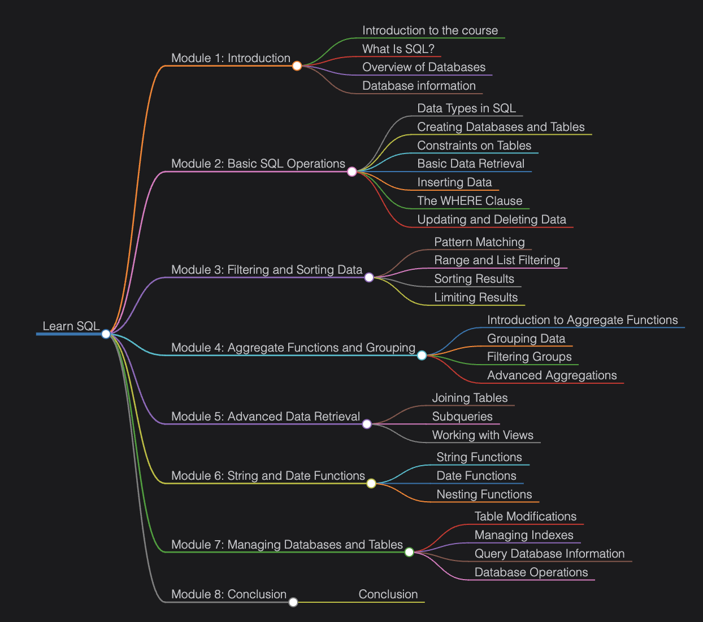

## Introduction to the Course



# What Is SQL?
> *Develop an understanding of SQL use cases and syntax.*

---

## Introduction

Imagine we have an online store that sells everything from electronics to kitchenware and fitness equipment. Storing and managing all this information — like product details, prices, categories, and orders — could be challenging if we relied on simple spreadsheets. This is where **SQL (Structured Query Language)** comes into play. It gives us the ability to interact with our data in a structured, efficient, and reliable way.

### 🎯 Learning Goals

By the end of this guide, you will:

- ✅ Understand what SQL is
- ✅ Learn why SQL is essential for database management
- ✅ Recognize the importance of SQL in organizing, querying, and maintaining data

---

## Understanding SQL

**SQL** stands for **Structured Query Language**. It is a specialized language used to communicate with databases that store information in a **relational format** — i.e., rows (records) and columns (fields).

Instead of manually organizing huge volumes of data, SQL gives us a systematic way to tell the database what we want to do — such as retrieving, inserting, or updating records.

### Why Is SQL Important?

Without a standard way to interact with data, we risk inconsistencies and inefficient storage. With SQL, we gain:

| Benefit | Description |
|---|---|
| **Consistency** | Every command follows a uniform structure — instructions remain orderly and predictable |
| **Efficiency** | Databases are optimized to process SQL queries quickly, even with large or complex data |
| **Scalability** | As data grows, SQL-based databases handle more information without drastically slowing down |

SQL allows us to **ask questions** about our data, **enforce rules** about what can be stored, and **keep our data safe and organized**.

---

## Role of SQL in Database Management

SQL serves as a universal language for a wide range of database tasks:

- 🏗️ **Creating and modifying structures** — Define how tables look and how they relate to each other
- 🔍 **Reading data** — Retrieve exactly the information you need from specific tables
- ✏️ **Updating and deleting data** — Modify existing records or remove them entirely
- 🔒 **Enforcing rules and security** — Impose constraints and manage user permissions

When working with multiple tables — like `Products`, `Categories`, and `Orders` in an `OnlineStore` database — SQL manages the relationships between them so everything stays consistent. This is invaluable for real-world scenarios like generating sales reports or analyzing inventory levels.

---

## Your First SQL Statement

Here is a simple SQL snippet that fetches data from the `OnlineStore` database:

```sql
USE OnlineStore;

SELECT CategoryID, CategoryName
FROM Categories;
```

### Breaking It Down

| Line | Code | What It Does |
|---|---|---|
| 1 | `USE OnlineStore;` | Tells the SQL server to work with the `OnlineStore` database |
| 3 | `SELECT CategoryID, CategoryName` | Specifies the columns we want to retrieve |
| 4 | `FROM Categories;` | Specifies the table to retrieve data from |

> 💡 **Think of it like asking a question in plain English:** *"From the Categories table, give me the CategoryID and CategoryName."*

---

## Comments in SQL

Comments are annotations that are **ignored by the database engine**. They help document your code for better understanding and collaboration.

### Single-Line Comments

Use `--` to start a single-line comment. Everything after `--` on that line is ignored.

```sql
-- This is a single-line comment
SELECT CategoryID FROM Categories; -- Fetching category IDs only
```

### Multi-Line Comments

Use `/* ... */` to write comments that span multiple lines.

```sql
/*
  This query retrieves all product names
  from the Products table.
  Author: Your Name
  Date: 2025
*/
SELECT ProductName
FROM Products;
```

---

## The Semicolon `;` in SQL

In standard SQL, the **semicolon (`;`)** marks the **end of a statement** (called a *statement terminator*).

```sql
/*
  Running multiple queries together —
  each must end with a semicolon.
*/
SELECT ProductName
FROM Products;

SELECT CategoryName
FROM Categories;
```

### When to Use It

| Scenario | Use Semicolon? |
|---|---|
| Running multiple queries in a script | ✅ Required |
| Single standalone command | ⚠️ Recommended (optional) |
| MySQL environment | ✅ Always recommended |

---

## More Examples

### Example 1: Retrieve All Products

```sql
USE OnlineStore;

-- Get all columns from the Products table
SELECT *
FROM Products;
```

### Example 2: Filter by Category

```sql
USE OnlineStore;

/*
  Retrieve only products that belong
  to the 'Electronics' category (CategoryID = 1)
*/
SELECT ProductName, Price
FROM Products
WHERE CategoryID = 1;
```

### Example 3: Retrieve Orders with a Limit

```sql
USE OnlineStore;

-- Get the first 5 orders placed
SELECT OrderID, OrderDate, TotalAmount
FROM Orders
LIMIT 5;
```

### Example 4: Sort Results

```sql
USE OnlineStore;

-- Retrieve products sorted by price (lowest first)
SELECT ProductName, Price
FROM Products
ORDER BY Price ASC;
```

---

## ✅ Best Practices

| Practice | Why It Matters |
|---|---|
| **Use UPPERCASE for SQL keywords** (`SELECT`, `FROM`, `WHERE`) | Improves readability and is a widely adopted convention |
| **Always specify the correct database** with `USE database_name;` | Prevents accidentally querying the wrong database |
| **Only retrieve what you need** — avoid `SELECT *` in production | Reduces load and improves performance |
| **Comment your queries** | Makes code easier to maintain and collaborate on |
| **Use semicolons consistently** | Ensures compatibility across SQL environments and scripts |

---

## ❌ Common Mistakes to Avoid

> ⚠️ **SQL is not a general-purpose programming language.** It is designed for database queries and operations — not a replacement for Python, Java, or C++.

> ⚠️ **Forgetting `USE database_name;`** before running queries can cause you to accidentally modify the wrong database.

> ⚠️ **Using `SELECT *` carelessly** retrieves all columns, which can be slow and exposes unnecessary data.

> ⚠️ **Missing semicolons in scripts** with multiple queries can cause execution errors or unexpected behavior.

---

## Summary

| Concept | Key Takeaway |
|---|---|
| **What is SQL?** | A standard language for communicating with relational databases |
| **Why use SQL?** | Consistency, efficiency, and scalability in data management |
| **Core capabilities** | Create, Read, Update, Delete (CRUD) operations |
| **Comments** | `--` for single-line, `/* */` for multi-line |
| **Semicolon** | Marks the end of a SQL statement; always recommended |

---

## What's Next?

We've laid the foundation by understanding what SQL is and why it's central to relational database management. Coming up next:

- 🗄️ **Creating Databases and Tables**
- 🔗 **Understanding Table Relationships**
- 🔍 **Writing Advanced Queries with WHERE, ORDER BY, and JOIN**

> *Keep going — there's plenty more to learn and master!* 🚀

---

*Made with ❤️ for SQL learners everywhere.*